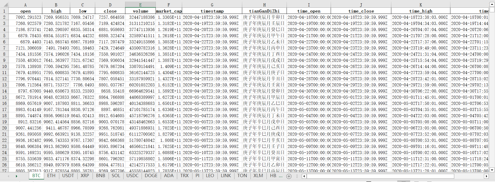

# data-provider

a web3 data collector lib

## Quick Start

### Get MarketCap Top 20 OHLCV From CMC

example:



```bash
# install nvm
# nvm use 23
pnpm install

# you should change the cmc api key in .env
cp .env.example .env

# generate the json file, the file is in the debug/cmc.json
pnpm dev

# generate the xlsx file, the file is in the debug/cmc.xlsx
# python3 -m pip install pandas openpyxl
# python3 debug/main.py
```

## TODO

- add prometheus metrics to monitor the api status
- fix the auto generated sdk (CryptocurrencyOHLCVHistoricalResultsObject.quotes)
